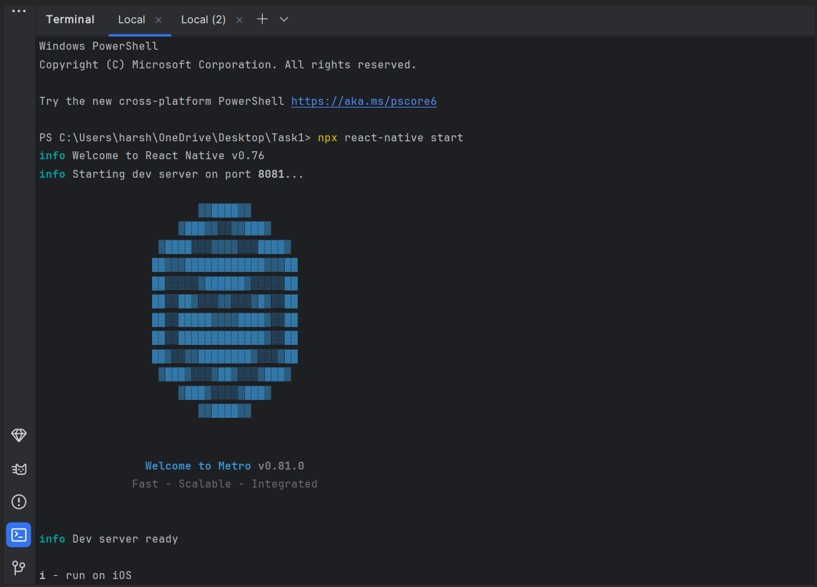
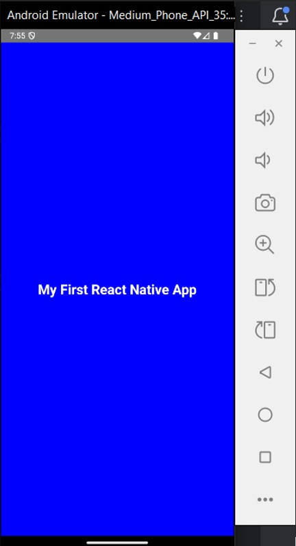
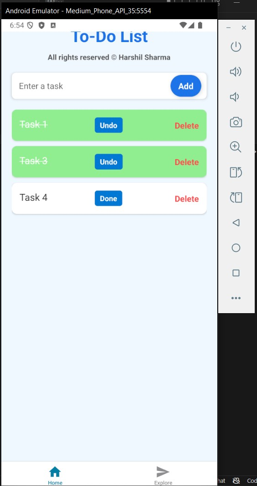

# React Native Development Report

## Author: Harshil Sharma

### Date: November 2024

[GitHub Link: Lab 3 Repository](https://github.com/xxender13/Lab3.git)

## Overview
This repository contains the tasks related to setting up a React Native development environment and building a simple To-Do List application to understand the core concepts of React Native, including state management, list rendering, handling user interactions, and animations. The report and associated screenshots are divided into two tasks:

1. Task 1: Setting up the Development Environment for React Native.
2. Task 2: Building a Simple To-Do List Application.

## Task 1: Set Up the Development Environment
In this task, I set up the development environment to build React Native applications.

### Steps Included:
1. **Install Node.js and Watchman**: Installed Node.js from the official website and Watchman using Homebrew.
2. **Install React Native CLI**: Installed React Native CLI using `npm` or `npx`.
3. **Set Up Android Studio and Xcode**: Installed Android Studio (for Android) and Xcode (for iOS) with the necessary SDK tools.
4. **Create a New React Native Project**: Initialized a new React Native project.
5. **Open Project in Visual Studio Code**: Installed the React Native Tools extension in VS Code.
6. **Start Metro Bundler**: Ran the Metro Bundler using `npx react-native start`.
7. **Run the App on Emulator or Device**: Ran the application on an Android or iOS device.
8. **Run the App Using Expo**: Created a new Expo project and connected a physical device using the Expo Go app.

### Screenshots

#### Android SDK Setup in Android Studio

#### Metro Bundler Started in Terminal

#### App Running on Android Emulator

#### App Running on Physical Device using Expo

## Task 2: Building a Simple To-Do List App
In this task, I built a simple To-Do List application using React Native. The app implements basic task management features and provides hands-on experience with state management, list rendering, and handling user interactions.

### Features Implemented
- **Add New Tasks**: Users can add a new task to the to-do list.
- **Update Existing Tasks**: Users can edit a task.
- **Delete Tasks**: Users can delete tasks.
- **Scrollable Task List**: Supports scrolling for a large number of tasks.
- **User-Friendly Interface**: Intuitive UI for managing tasks.
- **Mark Tasks as Complete**: Tasks can be marked as completed, showing visual indicators.
- **Persist Data Using AsyncStorage**: Data persists even after the app is closed.
- **Add Animations**: Added animations to enhance user experience.

### Step-by-Step Implementation
1. **Set Up the Project**: Created and opened the project using Expo CLI.
2. **Create the Basic To-Do List Structure**: Replaced the content of `App.js` with the basic structure of the to-do list.
3. **Running the App**: Compiled and ran the application on the selected platform (Android or iOS).

### Screenshots

#### Setting up the To-Do List Project

#### Adding Tasks to the To-Do List on Emulator

#### Adding Tasks to the To-Do List on Physical Device

#### Editing a Task in the To-Do List App on Emulator

#### Editing a Task in the To-Do List App on Physical Device

#### Deleting a Task from the To-Do List on Emulator

#### Deleting a Task from the To-Do List on Physical Device

#### Task Marked as Complete with Strikethrough on Emulator

#### Task Marked as Complete with Strikethrough on Physical Device

#### Running the To-Do List App on Android Emulator

#### Running the To-Do List App on Physical Device

## Conclusion
- **Task 1**: Learned how to set up the development environment for React Native, including installing dependencies and running the project on different platforms.
- **Task 2**: Developed a simple To-Do List app focusing on state management, user interactions, and extending the app's functionality with data persistence and animations.

## Result
The final outcome was a fully functional To-Do List app allowing users to add, update, delete, and mark tasks as complete. The app supports data persistence and has animations for enhanced user experience.

## Disclosure
A Language Model (LLM) was used to resolve syntax issues and address some React Native initialization challenges. However, I fully understand the content and solutions implemented in this report.
